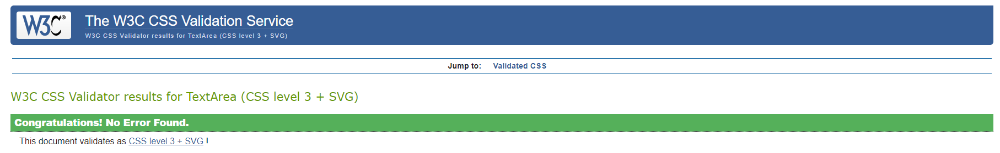

# Chocolate Treats Ecommerce Website

This is an ecommerce store that sells handmade chocolate bars.

Link to the deployed project:

[Deployed website](https://p-5-bf8a9d578875.herokuapp.com/)

## Table of contents

- [Scope](#scope)
- [Business model](#business-model)
- [Marketing](#marketing)
    - [Keywords](#keywords)
    - [Facebook page](#facebook-page)
- [Sitemap](#sitemap)
- [User stories](#user-stories)
- [Wireframes](#wireframes)
- [Features](#features)
    - [Header](#header)
    - [Landing page](#landing-page)
    - [Footer](#footer)
    - [Menu](#menu)
    - [Products](#products)
    - [Form for adjusting quantity of products](#form-for-adjusting-quantity-of-products)
    - [Shopping bag](#shopping-bag)
- [Bugs](#bugs)
- [Testing](#testing)
    - [W3C HTML test](#w3c-html-test)
    - [W3C CSS test](#w3c-css-test)
    - [JSHint test](#jshint-test)
    - [CI Python Linter test](#ci-python-linter-test)
    - [Browser testing](#browser-testing)
    - [Manual testing](#manual-testing)    
- [Deployment](#deployment)
- [Credits](#credits)
- [Acknowledgements](#acknowledgements)

## Scope

The following must be included in the project:

- Products page
- Page showing information about an individual product
- Accounts
- Shopping bag
- Checkout

A filtering feature is not necessary in the app because the company only sells chocolate bars and they are all the same price.

## Business model

The business is a B2C (business to consumer) ecommerce business selling luxury handmade chocolate bars made from ethically sourced ingredients. The products are only sold online. Customers choose a bar or bars on the business website. The bars they choose are added to their shopping bag. They can edit the amount of bars in the shopping bag. When they decide to make a purchase they can easily do so on the website with the help of Stripe. Once they have made a purchase they receive a confirmation email. The product is then sent out to them. The aims of the ecommerce website are to inform visitors about the range of chocolate bars for sale, to maximise sales and to make it easy for people to make a purchase.

CORE BUSINESS INTENTS

The business owner wants to make a profit selling luxury handmade chocolate bars made from ethically sourced ingredients. 

TARGET AUDIENCE

The target audience are chocolate lovers who want luxury handmade chocolate bars. The target audience also includes people who want to buy some luxury chocolate
as a gift for someone.

MARKETING STRATEGY

The business regularly engages with customers by holding product tasting events and having an email newsletter. The business offers free delivery after a customer spends over a certain amount of money on an order. The business also has a Facebook page that they can use to build up awareness of the business and where they can connect with customers and potential customers.

## Marketing

### Keywords

chocolate bar, sugar free chocolate, sugar free chocolate bar, dairy free chocolate, filled chocolate bars, hand made chocolates, dark chocolate, vegan chocolate bars, vegan chocolate, dark chocolate bar

### Facebook page

Here is the link to the Facebook page for the business:

[Facebook](https://www.facebook.com/profile.php?id=61558026373048)

Here is an image of the Facebook page:

## Sitemap

## User stories

Here is a picture of the GitHub project board for this project:

Epic - Navigation

- As a site user I want to view the products so that I can choose a product.

- As a site user I want to view product details easily so that I can know enough information to make a choice.

- As a site user I want to easily view the total cost of my purchases so that I can avoid spending too much money.
  
Epic - User accounts

- As a site user I want to easily make an account so that I can more easily make purchases.

- As a site user I want to login and logout so that I can access my account.

- As a site user I can easily login to my account if I forget my password.

- As a site user I can have my own user profile so that I can view my order history and save my payment information.

Epic - Shopping bag

- As a site user I can easily change the quantity of a product in my shopping bag.

- As a site user I can easily view items in my shopping bag.

Epic - Checkout

- As a site user I can easily enter my payment details so that I can make a purchase.

- As a site user I can view an order confirmation after making an order.

- As a site user I get an email confirmation after making an order.

Epic - Store management

- As a store owner I can easily add new items to my store.

- As a store owner I can delete products from my store.

Epic - Events

- As a site user I can see a list of events.

- As a site user I can easily put my name down for events.

Epic - Contact

- As a site user I can contact the business easily.

- As a store owner I can receive messages from customers.

Epic - Products

- As a site user I can easily see what products are for sale.

- As a site user I can see a picture of the product so that I know what it looks like.

- As a site user I can read a description of a product so that I can learn more about the product before deciding to buy or not.

Epic - Reviews

- As a site user I can read reviews about a product so that I can get more information about the product.

- As a site user I can write a review about a product.

## Wireframes

Here are some of the wireframes I made for the mobile screens:

## Database schema

## Features

### Header

### Landing page

### Footer

### Menu

### Products

### Form for adjusting quantity of products

### Shopping bag

## Bugs

There are no current bugs in the project.

These are some of the bugs that occurred during the development of the project:

- The font for the logo wasn't showing up. This was solved by adding links in the <head></head> section of the html file.

- The css file had an error in it. This was solved by removing the font import from the base.css.

- The menu button wasn't showing up. This was solved by editing the css.

- The products are not showing up on the products page.

- The login page was not working. This was solved by editing login.html.

- The buttons for adding and subtracting items from shopping bag were not working. This has been solved.

- The padlock sign was not on the buttons. This was solved by editing the css.

- The reviews were not showing up on the product_details page. This was solved by changing the for loop.

- The buttons for deleting and editing reviews where in the wrong place but that has been solved now.

- The contact form and the attendance form were not emptying once the form had been submitted. This has now been solved by editing the views.

## Testing

### W3C HTML test

The HTML was tested with [HTML W3C Validator](https://validator.w3.org) and no major errors were found.

### W3C CSS test

The CSS was tested with [CSS W3C Validator](https://jigsaw.w3.org/css-validator/). No issues were found.

### JSHint test 

JavaScript was tested with [JSHint](https://jshint.com/) and no major issues were found.

### CI Python Linter test

Python was tested with the CI Python Linter. No major issues were found.

### Browser testing

The website was tested on a variety of browsers. It was also tested in Google 
Chrome DevTools to see what it looks like in a variety of screen sizes.

### Manual testing

LANDING PAGE

Is the landing page displaying correctly?
Yes.

Do all the links on the landing page work?
Yes.

CREATING AN ACCOUNT

Can the user create an account?
Yes.

Does the user get a confirmation email when they create an account?
Yes.

SIGNING IN AND OUT

Can the user sign in and out easily?
Yes.

Is the CSS working properly?
Yes.

SUBSCRIBING TO THE NEWSLETTER

Can the user subscribe to the email newsletter?
Yes.

Does the user receive a confirmation message after subscribing to the newsletter?
Yes.

MAKING AN ORDER

Can the user easily navigate to the page where the chocolate bars are shown?
Yes.

Can the user select a product to add to their shopping bag?
Yes.

Can the user adjust the number of products in their shopping bag?
Yes

Can the user enter their delivery address and payment details to make a purchase?
Yes.

Does the user get an order confirmation once they have completed a purchase?
Yes.

Can the user empty their shopping bag?
Yes.

Can the user pay for their order?
Yes.

REVIEWS

Can the user write and publish a product review?
Yes.

Can the user update their review?
Yes.

Is there a confirmation message after the user updates their review?
Yes.

Can the user delete their review?
Yes.

Is there a confirmation message after the user deletes their review?
Yes.

EVENTS

Are upcoming events displayed on the events page?
Yes.

Can the user submit the attendance form?
Yes.

Does the user get a confirmation message after they submit the events form?
Yes.

Does the form inform the user about errors in the form?
Yes.

CONTACT

Can the user submit the contact form?
Yes.

Does the user get a confirmation message after they send their message?
Yes.

Does the form inform the user about errors in the form?
Yes.

NAVIGATION

Are the links on the site working properly?
Yes.

## Deployment

LOCAL DEPLOYMENT

1. Select the "Clone or download" button in GitHub to clone the repository.

2. Open a new terminal in your IDE.

3. Set the location of the current working directory to where you want the cloned directory to be made.

4. Type git clone, then your URL and then press Enter.

5. Type python -m venv venv in the terminal to create a virtual environment.

6. Type venv\bin\activate in the terminal to activate the virtual environment.

7. Type pip install -r requirements.txt in the terminal to install the requirements.

8. Add a .env file in the root director and add the following environment variables:

   os.environ.setdefault("STRIPE_PUBLIC_KEY", "xxxxxxxxx")

   os.environ.setdefault("STRIPE_PRIVATE_KEY", "xxxxxxxxx")

   os.environ.setdefault("STRIPE_WH_SECRET", "xxxxxxxxx")

   os.environ.setdefault("SECRET_KEY", "xxxxxxxxxx")

   os.environ.setdefault("DEBUG", "False || True")

9. Type python manage.py makemigrations and then python manage.py migrate in the terminal.

10. Type python manage.py createsuperuser in the terminal.

11. Type python manage.py runserver in the terminal to run the app.

HEROKU DEPLOYMENT

1. Sign up for an account at the Heroku website:

   https://signup.heroku.com/

2. Select the "New" button and then select "Create new app".

3. Name your new app and select the region closest to you.

4. Select "Create app".

5. Select "settings".

6. Select the "Reveal Confic Vars" button.

7. Enter these environment variables and add your values:

   STRIPE_PUBLIC_KEY

   STRIPE_SECRET_KEY

   STRIPE_WH_SECRET

   SECRET_KEY

8. Select buildpacks from the top menu. Add the following:

   heroku/python

9. Select the "Deploy" tab.

10. Select the "Connect to GitHub" button.

11. Find your repository and select the "Connect" button.

12. Select the "Enable Automatic Deploys" button.

13. Select the "Deploy Branch" button.

14. View the app by selecting the "View" button.

## Credits

w3 schools 

Code Institute

stackoverflow

Dennis Ivy

Codemy.com

## Acknowledgements

Code Institute tutors

My Mentor

