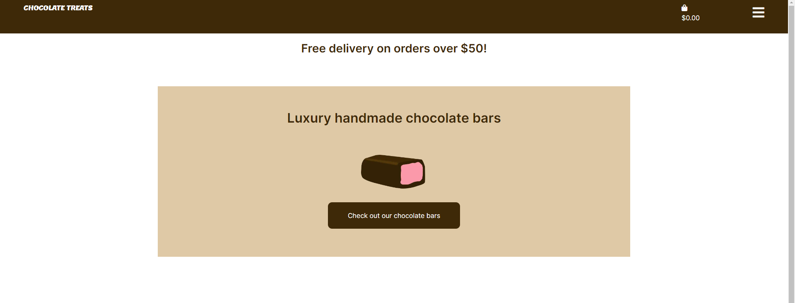

# Chocolate Treats Ecommerce Website

This is an ecommerce store that sells handmade chocolate bars.

Link to the deployed project:

[Deployed website](https://p-5-bf8a9d578875.herokuapp.com/)

## Scope

The following must be included in the project:

- Products page
- Page showing information about an individual product
- Accounts
- Shopping bag
- Checkout

A filtering feature is not necessary in the app because the company only sells chocolate bars and they are all the same price.

## Marketing

The business is a B2C business that regularly engages with customers by holding product tasting events and having an email newsletter.

The business offers free delivery after a customer spends over a certain amount of money on an order. The business will also have a Facebook page and an email newsletter
that users can sign up to.

### Keywords

chocolate bar, sugar free chocolate, sugar free chocolate bar, dairy free chocolate, filled chocolate bars, hand made chocolates, dark chocolate, vegan chocolate bars, vegan chocolate, dark chocolate bar

### Facebook page

Here is the link to the Facebook page for the business:

[Facebook](https://www.facebook.com/profile.php?id=61558026373048)

Here is an image of the Facebook page:

## Sitemap

## User Stories

Here is a picture of the GitHub project board for this project:

Epic - Navigation

- As a site user I want to view a list of products so that I can choose a product.

- As a site user I want to view product details easily so that I can know enough information to make a choice.

- As a site user I want to easily view the total cost of my purchases so that I can avoid spending too much money.
  
Epic - User accounts

- As a site user I want to easily make an account so that I can more easily make purchases.

- As a site user I want to login and logout so that I can access my account.

- As a site user I can easily login to my account if I forget my password.

- As a site user I can receive an email confirmation after making an account.

- As a site user I can have my own user profile so that I can view my order history and save my payment information.

Epic - Shopping bag

- As a site user I can easily select the quantity of a product in my shopping bag.

- As a site user I can easily view items in my shopping bag.

Epic - Checkout

- As a site user I can easily enter my payment details so that I can make a purchase.

- As a site user I can view an order confirmation after making an order.

- As a site user I get an email confirmation after making an order.

Epic - Store management

- As a store owner I can easily add new items to my store.

- As a store owner I can delete products from my store.

Epic - Events

- As a site user I can see a list of events.

- As a site user I can easily put my name down for events.

Epic - Contact

- As a site user I can contact the business easily.

Epic - Reviews

- As a site user I can read reviews about a product so that I can get more information about the product.

- As a site user I can write a review about a product.

Epic - Products

- As a site user I can easily see what products are for sale.

- As a site user I can see a picture of the product so that I know what it looks like.

- As a site user I can read a description of a product so that I can learn more about the product before deciding to buy or not.

## Wireframes

Here are some of the wireframes I made for the mobile screens:

## Database Schema

## Features

### Header

### Landing page

### Footer

### Menu

### Products

### Form for adjusting quantity of products in shopping bag

### Shopping bag

## Bugs

## Testing

### W3C HTML Test

The project passed the W3C HTML test.

### W3C CSS Test

The project passed the W3C CSS test.

### JSHint Test 

The JavaScript was tested with JSHint and no problems were found.

### CI Python Linter Test

Python was tested with the CI Python Linter. No major issues were found.

### Browser Testing

The website was tested on a variety of browsers. It was also tested in Google 
Chrome DevTools to see what it looks like in a variety of screen sizes.

### Lighthouse Testing

This is the Lighthouse test result:

### Manual Testing

As I went through the project I manually tested each user story thoroughly. I tested the views, 
the models, the booking form and the authentication. The user can create an account so that they
can log in. They can log in with their details. They can view the appointments that they've
already booked and they can update or delete the bookings. They can use the booking form to book
an appointment and they can choose from a list of available appointments.

## Deployment

This project was deployed using Heroku.

A Procfile and a requirements.txt was added to the project.

A new app was set up in Heroku and the config vars were added to the app.

GitHub was selected as the deployment menthod and the GitHub repository was linked to Heroku.

"Deploy Branch" was selected to manually deploy the project.

## Credits

w3 schools 

Code Institute

stackoverflow

Dennis Ivy

Codemy.com

## Acknowledgements

Code Institute tutors

My Mentor

